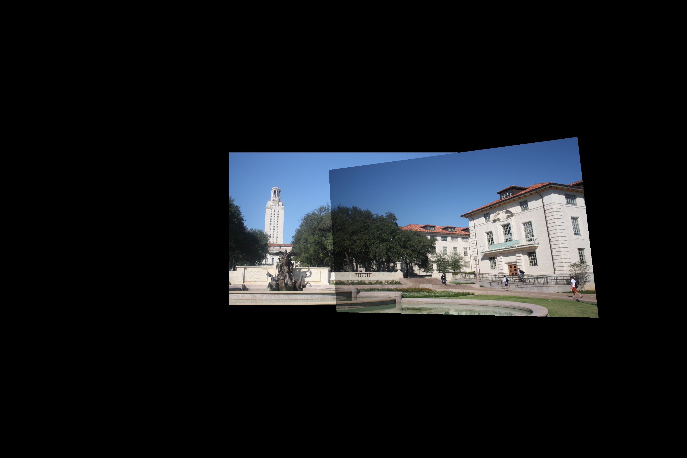

# Computer-Vision-Matlab
Simple Computer Vision Projects. Matlab Implementation

## Energy-based Image Reduction

## Keypoint Extraction

## Edge, Circle Detection

## KMeans Segmentation

## Panorama Stiching

